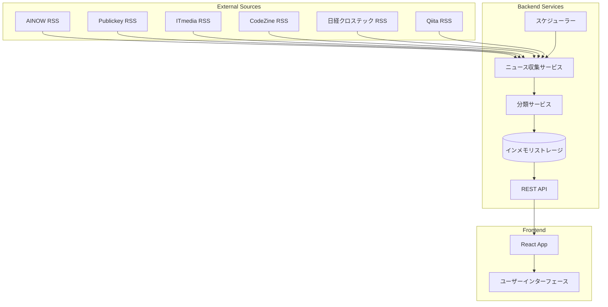

# 設計文書

## 概要

AIニュース集約システムは、複数のRSS情報源から自動的にAI関連ニュースを収集し、機械学習による分類を行い、React製のWebインターフェースで表示するシステムです。

## アーキテクチャ

### システム全体構成



### 技術スタック

**フロントエンド:**
- React 18 + TypeScript
- TailwindCSS (スタイリング)
- Axios (HTTP通信)
- React Router (ルーティング)

**バックエンド:**
- Node.js + Express
- TypeScript
- RSS Parser (rss-parser npm package)
- node-cron (スケジューリング)
- Winston (ログ管理)

**データストレージ:**
- インメモリ配列 (初期実装)
- 将来的にSQLite/PostgreSQL移行予定

## コンポーネントと インターフェース

### バックエンドコンポーネント

#### 1. ニュース収集サービス (NewsCollectorService)

```typescript
interface NewsItem {
  id: string;
  title: string;
  description: string;
  link: string;
  pubDate: Date;
  source: string;
  category?: AICategory;
  content?: string;
}

interface RSSSource {
  name: string;
  url: string;
  defaultCategory: AICategory;
}

class NewsCollectorService {
  async collectFromAllSources(): Promise<NewsItem[]>
  async collectFromSource(source: RSSSource): Promise<NewsItem[]>
  private parseRSSFeed(url: string): Promise<any[]>
  private convertToNewsItem(rssItem: any, source: RSSSource): NewsItem
}
```

#### 2. 分類サービス (ClassificationService)

```typescript
enum AICategory {
  AI_MODELS = 'AIモデル',
  AI_ASSISTANT = 'AIアシスタント',
  AI_AGENT = 'AIエージェント',
  AI_IDE = 'AI IDE',
  AI_CLI = 'AI CLIツール',
  AI_SEARCH = 'AI検索・ナレッジベース',
  AI_INTEGRATION = 'AI統合ツール',
  AI_MULTIMODAL = 'AI音声・マルチモーダル',
  AI_NOCODE = 'AIノーコードツール',
  AI_DATA_ANALYSIS = 'AIデータ分析'
}

class ClassificationService {
  classifyNews(newsItem: NewsItem): AICategory
  private analyzeContent(title: string, description: string): AICategory
  private getKeywordMatches(text: string): Map<AICategory, number>
}
```

#### 3. ストレージサービス (StorageService)

```typescript
class StorageService {
  private newsItems: NewsItem[] = [];
  
  async saveNews(items: NewsItem[]): Promise<void>
  async getAllNews(): Promise<NewsItem[]>
  async getNewsByCategory(category: AICategory): Promise<NewsItem[]>
  async getRecentNews(hours: number = 24): Promise<NewsItem[]>
  private isDuplicate(newItem: NewsItem): boolean
}
```

#### 4. スケジューラー (SchedulerService)

```typescript
class SchedulerService {
  private collector: NewsCollectorService;
  private classifier: ClassificationService;
  private storage: StorageService;
  
  startScheduledCollection(): void
  private async executeCollection(): Promise<void>
  stopScheduledCollection(): void
}
```

### フロントエンドコンポーネント

#### 1. メインアプリケーション (App.tsx)

```typescript
interface AppState {
  newsItems: NewsItem[];
  selectedCategory: AICategory | 'all';
  loading: boolean;
  error: string | null;
}

function App(): JSX.Element
```

#### 2. ニュース一覧 (NewsList.tsx)

```typescript
interface NewsListProps {
  newsItems: NewsItem[];
  selectedCategory: AICategory | 'all';
}

function NewsList({ newsItems, selectedCategory }: NewsListProps): JSX.Element
```

#### 3. カテゴリフィルター (CategoryFilter.tsx)

```typescript
interface CategoryFilterProps {
  selectedCategory: AICategory | 'all';
  onCategoryChange: (category: AICategory | 'all') => void;
  categoryCounts: Map<AICategory, number>;
}

function CategoryFilter(props: CategoryFilterProps): JSX.Element
```

#### 4. ニュースカード (NewsCard.tsx)

```typescript
interface NewsCardProps {
  newsItem: NewsItem;
}

function NewsCard({ newsItem }: NewsCardProps): JSX.Element
```

### REST API エンドポイント

```typescript
// GET /api/news - 全ニュース取得
// GET /api/news?category=AIモデル - カテゴリ別ニュース取得
// GET /api/news?recent=24 - 過去24時間のニュース取得
// GET /api/categories - カテゴリ一覧と件数取得
// POST /api/collect - 手動ニュース収集実行
// GET /api/status - システム状態取得
```

## データモデル

### NewsItem データ構造

```typescript
interface NewsItem {
  id: string;           // ユニークID (URL + pubDateのハッシュ)
  title: string;        // ニュースタイトル
  description: string;  // ニュース概要
  link: string;         // 元記事URL
  pubDate: Date;        // 公開日時
  source: string;       // 情報源名
  category: AICategory; // 分類カテゴリ
  content?: string;     // 記事本文（オプション）
  createdAt: Date;      // システム登録日時
}
```

### RSSSource 設定

```typescript
const RSS_SOURCES: RSSSource[] = [
  {
    name: 'AINOW',
    url: 'https://ainow.ai/feed/',
    defaultCategory: AICategory.AI_MODELS
  },
  {
    name: 'Publickey',
    url: 'https://www.publickey1.jp/atom.xml',
    defaultCategory: AICategory.AI_DATA_ANALYSIS
  },
  {
    name: 'ITmedia NEWS',
    url: 'https://rss.itmedia.co.jp/rss/2.0/news_bursts.xml',
    defaultCategory: AICategory.AI_ASSISTANT
  },
  {
    name: 'CodeZine',
    url: 'https://codezine.jp/rss/new/20/index.xml',
    defaultCategory: AICategory.AI_IDE
  },
  {
    name: '日経クロステック',
    url: 'https://xtech.nikkei.com/rss/index.rdf',
    defaultCategory: AICategory.AI_INTEGRATION
  },
  {
    name: 'Qiita',
    url: 'https://qiita.com/tags/ai/feed',
    defaultCategory: AICategory.AI_AGENT
  }
];
```

## エラーハンドリング

### エラー分類と対応

1. **RSS取得エラー**
   - ネットワークタイムアウト: 3回リトライ後スキップ
   - 404/500エラー: ログ記録後スキップ
   - パースエラー: ログ記録後スキップ

2. **分類エラー**
   - デフォルトカテゴリを使用
   - エラーログ記録

3. **フロントエンドエラー**
   - API通信エラー: ユーザーにエラーメッセージ表示
   - レンダリングエラー: エラーバウンダリで捕捉

### ログ設定

```typescript
// Winston設定例
const logger = winston.createLogger({
  level: 'info',
  format: winston.format.combine(
    winston.format.timestamp(),
    winston.format.json()
  ),
  transports: [
    new winston.transports.File({ filename: 'logs/error.log', level: 'error' }),
    new winston.transports.File({ filename: 'logs/combined.log' }),
    new winston.transports.Console()
  ]
});
```

## テスト戦略

### バックエンドテスト

1. **ユニットテスト**
   - NewsCollectorService: RSS解析とデータ変換
   - ClassificationService: カテゴリ分類ロジック
   - StorageService: データ保存と重複チェック

2. **統合テスト**
   - API エンドポイント
   - RSS取得からストレージまでの全体フロー

### フロントエンドテスト

1. **コンポーネントテスト**
   - React Testing Library使用
   - 各コンポーネントの表示とインタラクション

2. **E2Eテスト**
   - Playwright使用
   - ユーザーシナリオの自動テスト

### テストデータ

```typescript
// モックRSSデータ
const mockRSSData = {
  title: 'ChatGPT-4の新機能が発表',
  description: 'OpenAIが新しいマルチモーダル機能を発表しました',
  link: 'https://example.com/news/1',
  pubDate: new Date('2024-01-15T10:00:00Z'),
  source: 'AINOW'
};
```

## パフォーマンス考慮事項

### バックエンド最適化

1. **RSS取得の並列処理**
   - Promise.allSettled使用で並列取得
   - タイムアウト設定（30秒）

2. **メモリ使用量制限**
   - 最大保存件数: 1000件
   - 古いニュースの自動削除（7日経過）

3. **キャッシュ戦略**
   - RSS取得結果の短期キャッシュ（5分）
   - 分類結果のキャッシュ

### フロントエンド最適化

1. **仮想スクロール**
   - 大量ニュース表示時のパフォーマンス向上

2. **遅延読み込み**
   - 画像の遅延読み込み
   - コンポーネントの動的インポート

3. **状態管理**
   - React Context使用
   - 不要な再レンダリング防止